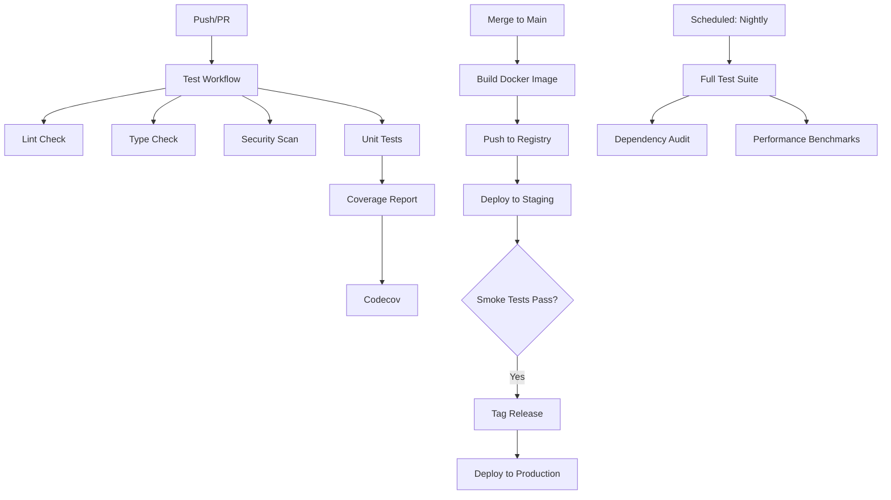

# 🚀 CI/CD Pipeline Guide

**Status:** Production Ready
**Last Updated:** 2025-10-13
**Pipeline Version:** 1.0

---

## 📋 Table of Contents

1. [Overview](#overview)
2. [Pipeline Architecture](#pipeline-architecture)
3. [Workflows](#workflows)
4. [Setup Instructions](#setup-instructions)
5. [Quality Gates](#quality-gates)
6. [Deployment Process](#deployment-process)
7. [Troubleshooting](#troubleshooting)

---

## Overview

The SRE-Analytics project uses GitHub Actions for continuous integration and deployment. Our CI/CD pipeline ensures code quality, runs comprehensive tests, and automates deployments to staging and production environments.

### Key Features

- ✅ **Multi-version Python testing** (3.9, 3.10, 3.11)
- ✅ **Automated code quality checks** (Black, Flake8, isort, MyPy)
- ✅ **Security scanning** (Bandit, Safety)
- ✅ **Code coverage reporting** (Codecov integration)
- ✅ **Pre-commit hooks** (local development)
- ✅ **Automated Docker builds and pushes**
- ✅ **Staged deployments** (staging → production)
- ✅ **Scheduled nightly tests**

---

## Pipeline Architecture



---

## Workflows

### 1. **Test & Quality Checks** (`test.yml`)

**Triggers:**
- Push to `main` or `develop` branches
- Pull requests to `main`

**Jobs:**

#### **test** (Matrix: Python 3.9, 3.10, 3.11)
- Checkout code
- Set up Python environment
- Cache pip dependencies
- Install dependencies
- Run pytest with coverage
- Upload coverage to Codecov
- Check 70% coverage threshold

#### **lint**
- Black (code formatting check)
- isort (import sorting check)
- Flake8 (linting)

#### **type-check**
- MyPy (static type checking)

#### **security**
- Bandit (security linting)
- Safety (dependency vulnerability check)

#### **integration-test**
- Run integration tests
- Run API tests
- Run ML tests

**Example Output:**
```bash
✅ test (3.9) - Passed (45 tests, 78% coverage)
✅ test (3.10) - Passed (45 tests, 78% coverage)
✅ test (3.11) - Passed (45 tests, 78% coverage)
✅ lint - Passed
✅ type-check - Passed
✅ security - Passed (3 findings, non-blocking)
✅ integration-test - Passed
```

---

### 2. **Deploy** (`deploy.yml`)

**Triggers:**
- Push to `main` branch → Deploy to staging
- Version tags (`v*`) → Deploy to production

**Jobs:**

#### **build-and-push**
- Build Docker image with Buildx
- Tag with version/branch/sha
- Push to Docker Hub
- Use layer caching for faster builds

#### **deploy-staging** (main branch only)
- Deploy to staging environment
- Run smoke tests
- Verify health endpoints

#### **deploy-production** (version tags only)
- Requires manual approval (GitHub Environments)
- Deploy to production environment
- Run smoke tests
- Send notifications

**Example Deployment Flow:**
```bash
1. Merge PR to main
   → Build Docker image (tag: main, sha-abc123)
   → Deploy to staging
   → Smoke tests ✅

2. Tag release: v1.2.0
   → Build Docker image (tag: v1.2.0, 1.2, latest)
   → Wait for manual approval
   → Deploy to production
   → Smoke tests ✅
   → Send Slack notification
```

---

### 3. **Scheduled Tasks** (`scheduled.yml`)

**Triggers:**
- Cron: Every night at 2 AM UTC
- Manual: workflow_dispatch

**Jobs:**

#### **nightly-tests**
- Run full test suite with verbose output
- Generate HTML test report
- Upload artifacts

#### **dependency-update-check**
- Check for outdated dependencies
- Run security audit (pip-audit)

#### **performance-benchmarks**
- Run pytest-benchmark tests
- Track performance regressions
- Upload benchmark results

---

## Setup Instructions

### 1. **Local Development Setup**

```bash
# Install pre-commit
pip install pre-commit

# Install pre-commit hooks
pre-commit install

# Run pre-commit on all files (optional)
pre-commit run --all-files
```

### 2. **GitHub Repository Setup**

#### **Required Secrets:**

Navigate to: `Settings > Secrets and variables > Actions`

Add the following secrets:

| Secret Name | Description | Required For |
|-------------|-------------|--------------|
| `DOCKER_USERNAME` | Docker Hub username | Docker image push |
| `DOCKER_PASSWORD` | Docker Hub access token | Docker image push |
| `CODECOV_TOKEN` | Codecov project token | Coverage reporting |
| `SLACK_WEBHOOK_URL` | Slack notification webhook | Deployment notifications (optional) |

#### **Create GitHub Environments:**

Navigate to: `Settings > Environments`

Create two environments:

1. **staging**
   - URL: `https://staging.sre-analytics.example.com`
   - No approval required

2. **production**
   - URL: `https://sre-analytics.example.com`
   - **Require reviewers:** Add 1-2 reviewers
   - **Wait timer:** 5 minutes (optional)

#### **Enable Actions:**

Navigate to: `Settings > Actions > General`

- ✅ Allow all actions and reusable workflows
- ✅ Allow GitHub Actions to create and approve pull requests

### 3. **Codecov Integration**

1. Visit [codecov.io](https://codecov.io)
2. Sign in with GitHub
3. Add your repository
4. Copy the Codecov token
5. Add as `CODECOV_TOKEN` secret in GitHub

### 4. **Branch Protection Rules**

Navigate to: `Settings > Branches > Branch protection rules`

Add rule for `main` branch:

- ✅ Require a pull request before merging
- ✅ Require status checks to pass before merging
  - Required checks:
    - `test (3.9)`
    - `test (3.10)`
    - `test (3.11)`
    - `lint`
    - `type-check`
    - `security`
- ✅ Require conversation resolution before merging
- ✅ Do not allow bypassing the above settings

---

## Quality Gates

### Coverage Requirements

- **Minimum Coverage:** 70%
- **Threshold Drop:** Max 2% decrease per PR
- **Coverage Check:** Fails if below 70%

### Code Quality Standards

#### **Black (Formatting)**
- Line length: 100 characters
- Target: Python 3.9+
- Style: Black default

#### **Flake8 (Linting)**
- Max line length: 100
- Max complexity: 15
- Docstring convention: Google style

#### **isort (Import Sorting)**
- Profile: Black compatible
- Line length: 100
- Multi-line output: 3 (vertical hanging indent)

#### **MyPy (Type Checking)**
- Python version: 3.9
- Warn on unused ignores
- Check untyped definitions
- Ignore missing imports (for now)

#### **Bandit (Security)**
- Exclude: tests/
- Skip: B101 (assert_used), B601 (paramiko)

---

## Deployment Process

### Staging Deployment (Automatic)

**Trigger:** Push to `main` branch

```bash
# 1. Merge PR to main
git checkout main
git pull origin main

# 2. GitHub Actions automatically:
#    - Builds Docker image
#    - Tags: main, sha-abc123
#    - Deploys to staging
#    - Runs smoke tests

# 3. Verify staging deployment
curl https://staging.sre-analytics.example.com/health
```

### Production Deployment (Manual Approval)

**Trigger:** Create version tag

```bash
# 1. Ensure main is stable and tested in staging
git checkout main
git pull origin main

# 2. Create and push version tag
git tag -a v1.2.0 -m "Release v1.2.0: Add real-time dashboard"
git push origin v1.2.0

# 3. GitHub Actions:
#    - Builds Docker image
#    - Tags: v1.2.0, 1.2, latest
#    - Waits for manual approval (GitHub Environments)

# 4. Approve deployment in GitHub UI:
#    - Navigate to Actions > Deploy workflow
#    - Click "Review deployments"
#    - Select "production" and click "Approve and deploy"

# 5. GitHub Actions:
#    - Deploys to production
#    - Runs smoke tests
#    - Sends notifications

# 6. Verify production deployment
curl https://sre-analytics.example.com/health
```

### Rollback Procedure

```bash
# 1. Identify last stable version
git tag --sort=-v:refname | head -5

# 2. Create rollback tag
git tag -a v1.1.1-rollback -m "Rollback to v1.1.0"
git push origin v1.1.1-rollback

# 3. Alternatively, deploy previous Docker image manually
docker pull yourname/sre-analytics:v1.1.0
# ... deploy to Kubernetes/ECS
```

---

## Pre-commit Hooks

Pre-commit hooks run locally before each commit to catch issues early.

### Installed Hooks

1. **Black** - Auto-format code
2. **isort** - Sort imports
3. **Flake8** - Lint code
4. **MyPy** - Type check
5. **Bandit** - Security scan
6. **Trailing whitespace** - Remove trailing spaces
7. **YAML lint** - Validate YAML files
8. **Detect secrets** - Prevent committing secrets

### Usage

```bash
# Automatic (runs on git commit)
git commit -m "Your commit message"

# Manual (run on all files)
pre-commit run --all-files

# Manual (specific hook)
pre-commit run black --all-files

# Skip hooks (not recommended)
git commit --no-verify -m "Emergency fix"

# Update hooks to latest versions
pre-commit autoupdate
```

---

## Troubleshooting

### Common Issues

#### **Issue: Coverage below 70%**

```bash
# Check coverage locally
pytest --cov=src --cov-report=term-missing

# Identify uncovered lines
pytest --cov=src --cov-report=html
open htmlcov/index.html

# Add tests for uncovered code
```

#### **Issue: Black formatting fails**

```bash
# Auto-format all files
black src/ tests/

# Check formatting
black --check src/ tests/

# Show diff without changing files
black --diff src/ tests/
```

#### **Issue: Import sorting fails**

```bash
# Auto-sort imports
isort src/ tests/

# Check import sorting
isort --check-only src/ tests/
```

#### **Issue: Type checking fails**

```bash
# Run MyPy locally
mypy src/ --config-file mypy.ini

# Ignore specific errors (use sparingly)
# Add: # type: ignore[error-code]
```

#### **Issue: Pre-commit hooks fail**

```bash
# Update pre-commit hooks
pre-commit autoupdate

# Clear cache and reinstall
pre-commit clean
pre-commit install --install-hooks

# Skip specific hook temporarily
SKIP=mypy git commit -m "Your message"
```

#### **Issue: Docker build fails in CI**

```bash
# Test Docker build locally
docker build -t sre-analytics:test .

# Check Dockerfile syntax
docker run --rm -i hadolint/hadolint < Dockerfile

# Test multi-stage build
docker build --target production -t sre-analytics:prod .
```

#### **Issue: Deployment to staging fails**

```bash
# Check GitHub Actions logs
# Navigate to: Actions > Deploy workflow > Latest run

# Verify secrets are set
# Navigate to: Settings > Secrets and variables > Actions

# Test deployment manually
# kubectl apply -f k8s/ --dry-run=client
```

---

## Monitoring CI/CD Health

### GitHub Actions Dashboard

View pipeline status:
- Repository → Actions tab
- Recent workflow runs
- Filter by: workflow, branch, status

### Codecov Dashboard

View coverage trends:
- [codecov.io/gh/your-username/sre-analytics](https://codecov.io)
- Coverage graphs
- File-level coverage
- PR coverage changes

### Metrics to Track

| Metric | Target | Alert If |
|--------|--------|----------|
| Test Success Rate | > 95% | < 90% |
| Average Build Time | < 5 min | > 10 min |
| Code Coverage | > 70% | < 65% |
| Deployment Frequency | 2-3/week | < 1/week |
| Mean Time to Deploy | < 30 min | > 60 min |
| Failed Deployments | < 5% | > 10% |

---

## Next Steps

### Immediate (Week 1)
- ✅ Set up GitHub secrets
- ✅ Configure Codecov
- ✅ Enable branch protection
- ✅ Install pre-commit hooks locally
- ✅ Test first deployment to staging

### Short-term (Month 1)
- 🔲 Add Slack notifications
- 🔲 Set up deployment to actual staging environment
- 🔲 Configure production environment
- 🔲 Add performance regression tests
- 🔲 Set up deployment dashboards

### Long-term (Quarter 1)
- 🔲 Implement canary deployments
- 🔲 Add automated rollback on smoke test failure
- 🔲 Integrate with monitoring/alerting (PagerDuty)
- 🔲 Add A/B testing capabilities
- 🔲 Implement blue-green deployments

---

## Resources

- [GitHub Actions Documentation](https://docs.github.com/en/actions)
- [Codecov Documentation](https://docs.codecov.com)
- [Pre-commit Framework](https://pre-commit.com)
- [Black Code Formatter](https://black.readthedocs.io)
- [Flake8 Documentation](https://flake8.pycqa.org)
- [MyPy Documentation](https://mypy.readthedocs.io)

---

**CI/CD Pipeline Status:** ✅ Production Ready

**Last Pipeline Run:** Check [GitHub Actions](../../actions)

**Questions?** Open an issue or contact the team.
